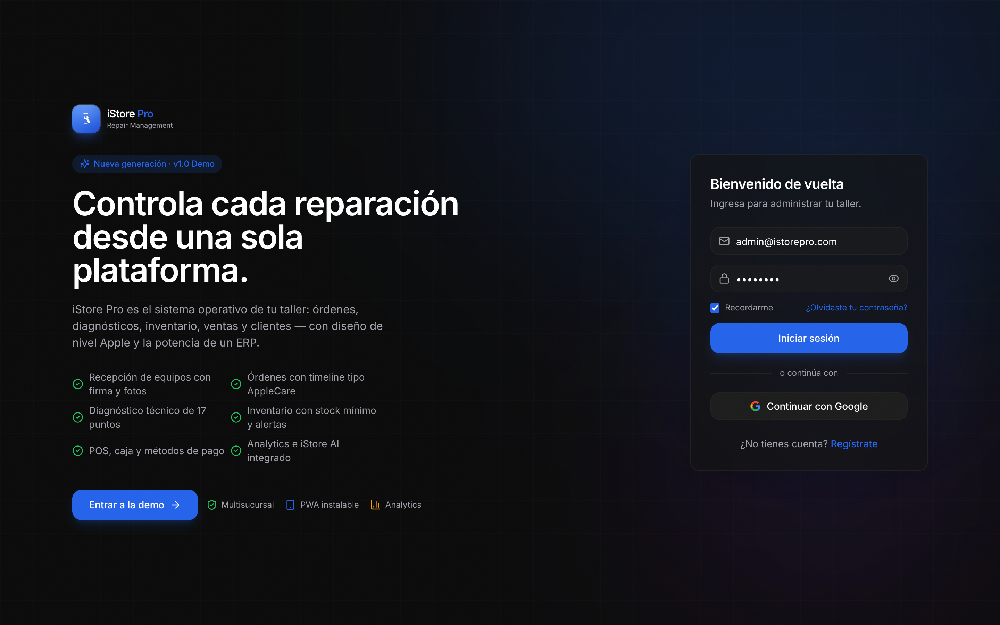
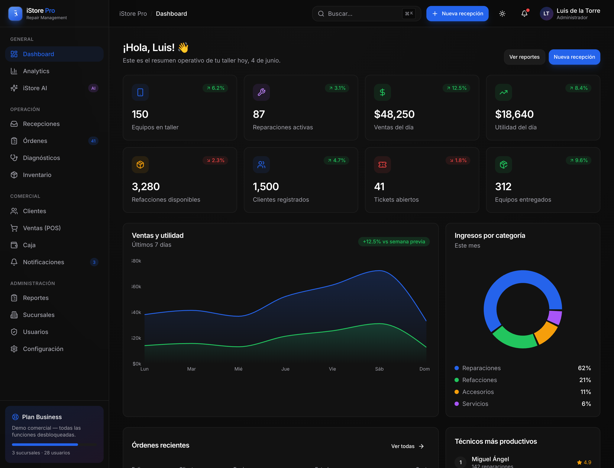
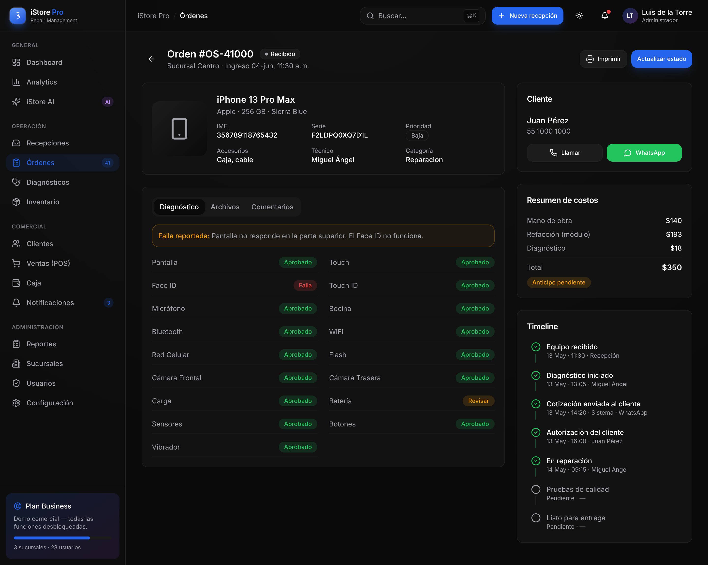
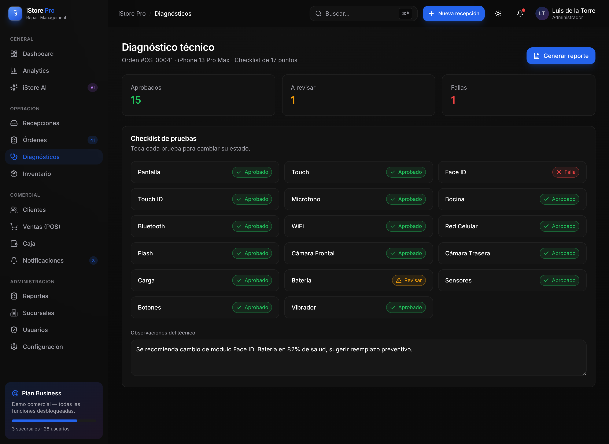
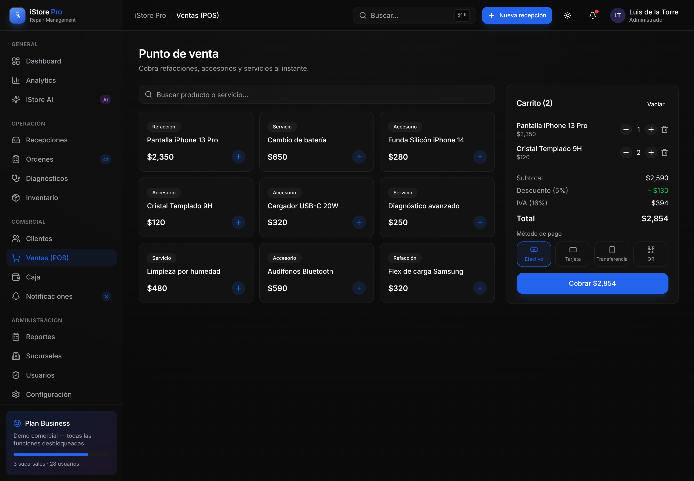
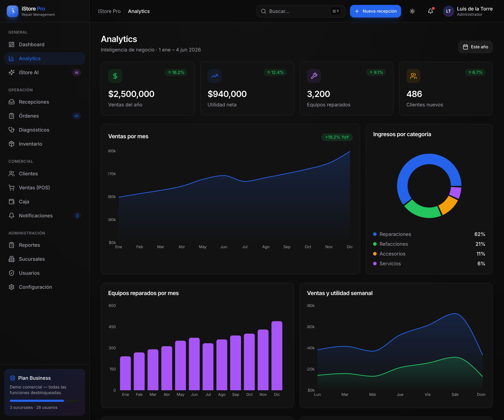
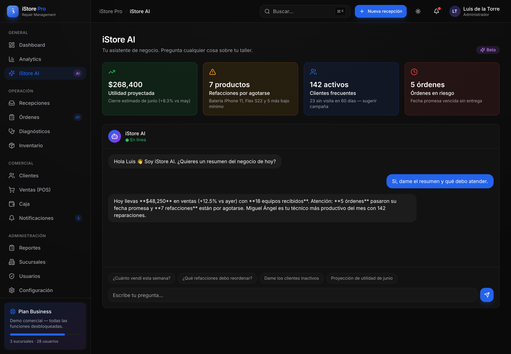
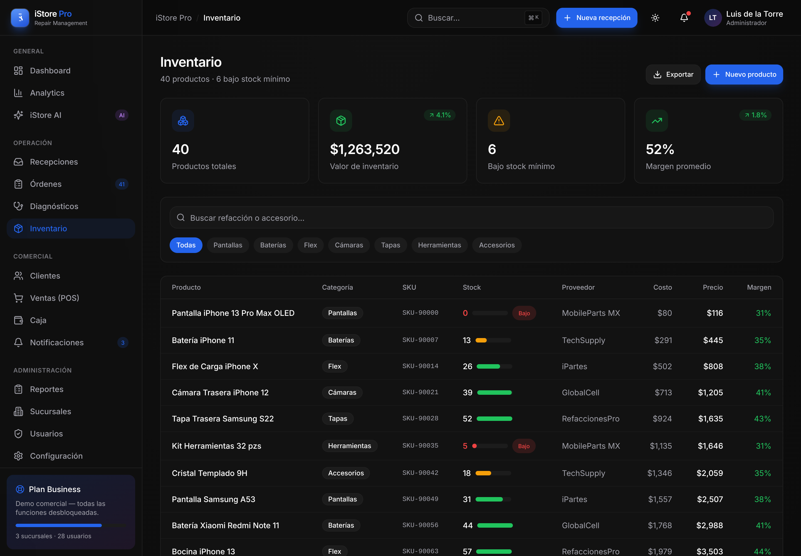
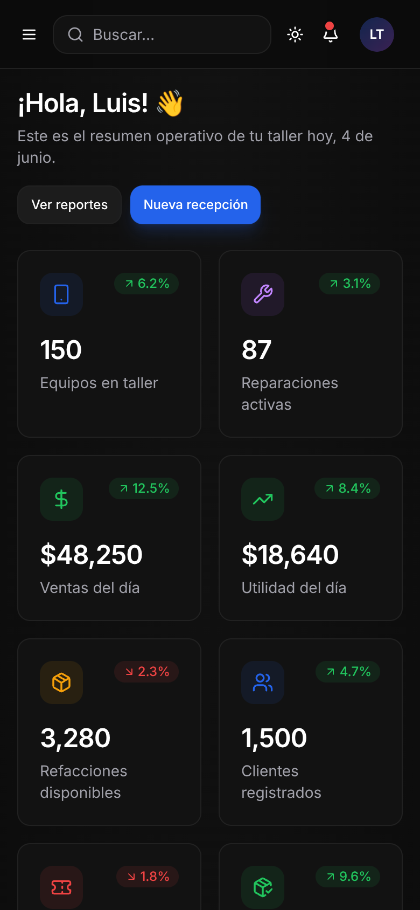

<div align="center">

# 📱 iStore Pro

### Sistema inteligente para talleres de reparación

**Celulares · Tablets · Computadoras · Accesorios · Refacciones**

Una aplicación web premium tipo SaaS, con diseño de nivel Apple, para el control
operativo completo de talleres de reparación.

`Next.js 14` · `React 18` · `TypeScript` · `Tailwind CSS` · `shadcn/ui` · `Recharts` · `PWA`

</div>

---

> ✅ **App con backend real.** Datos en **Neon Postgres** (`lib/data.ts`), auth con
> **Clerk**, correos con **Resend** y modelo **marketplace multi-tienda** (iStore es
> la tienda principal). Si faltan las env vars de Clerk, corre en *modo demo* (sin
> login) para no romper presentaciones. `lib/mock-data.ts` solo se usa para sembrar
> datos de ejemplo bajo la bandera `SEED_DEMO=true`.

---

## 🎯 Objetivo

Ofrecer a un taller de reparación una **única plataforma** para administrar todo
su negocio: recepción de equipos, órdenes de servicio, diagnósticos técnicos,
inventario, ventas (POS), caja, clientes (CRM), notificaciones, reportes,
analytics y operación multisucursal — con una experiencia de usuario impecable.

## ✨ Características

- 🎨 **Diseño premium** inspirado en Apple, Linear, Stripe, Notion, Arc, Raycast, Vercel e iOS 26.
- 🌗 **Tema claro / oscuro / automático** persistente (sin FOUC, tokens en todas las vistas).
- 📲 **PWA instalable** — manifest, service worker y soporte offline básico.
- 📱 **Responsive total** — desktop, tablet y mobile.
- ⌘ **Command Palette** global (`⌘/Ctrl + K`).
- 📊 **Gráficas interactivas** (área, barras y dona) con Recharts.
- 🤖 **iStore AI** — asistente de negocio con insights simulados.
- 🧩 Componentes premium: metric cards, tablas, timeline, drawer, modales, badges de estado, glass effects y micro-interacciones.

## 📸 Capturas

> Capturas reales de la app en ejecución (no son renders). Regenéralas con `npm run shots` (levanta el server en `:3120` y usa un Chromium headless).

| Landing | Dashboard | Detalle de orden |
|---|---|---|
|  |  |  |

| Diagnóstico | Punto de venta | Analytics |
|---|---|---|
|  |  |  |

| iStore AI | Inventario | Móvil (PWA) |
|---|---|---|
|  |  |  |

## 🧱 Arquitectura

```
istore/
├── app/
│   ├── layout.tsx            # Layout raíz (tema, fuentes, PWA)
│   ├── page.tsx              # Landing + Login
│   ├── login-card.tsx        # Tarjeta de autenticación (demo)
│   ├── icon.svg              # Favicon
│   └── (app)/                # Shell autenticado (sidebar + topbar)
│       ├── layout.tsx
│       ├── dashboard/        # KPIs, gráficas y actividad
│       ├── analytics/        # Inteligencia de negocio
│       ├── asistente/        # iStore AI
│       ├── recepciones/      # Alta de equipos (wizard)
│       ├── ordenes/          # Listado + detalle ([id]) tipo AppleCare
│       ├── diagnosticos/     # Checklist 17 puntos + reporte PDF
│       ├── inventario/       # Stock, márgenes y alertas
│       ├── clientes/         # CRM con ficha de cliente
│       ├── ventas/           # Punto de venta (POS)
│       ├── caja/             # Corte, ingresos y egresos
│       ├── notificaciones/   # Centro multicanal + mensajes automáticos
│       ├── reportes/         # Exportables (Excel / PDF)
│       ├── sucursales/       # Multisucursal y comparativos
│       ├── usuarios/         # Usuarios, roles y permisos
│       └── configuracion/    # Empresa, pagos, facturación, integraciones
├── components/
│   ├── ui/                   # Componentes base estilo shadcn
│   ├── layout/               # Sidebar, topbar, command palette, mobile nav
│   ├── charts.tsx            # Wrappers de Recharts
│   ├── metric-card.tsx
│   ├── status-badge.tsx
│   └── ...
├── lib/
│   ├── db.ts                 # Conexión Neon (serverless)
│   ├── schema.ts             # Migración idempotente + seed tienda principal
│   ├── data.ts               # Capa de datos real (CRUD órdenes/ventas/tiendas…)
│   ├── access.ts             # Patrón liga-llave (cookie de acceso)
│   ├── email.ts              # Correos transaccionales (Resend)
│   ├── mock-data.ts          # Datos de ejemplo (solo seed con SEED_DEMO=true)
│   └── utils.ts              # Helpers (formato, fechas, cn)
└── public/
    ├── manifest.json         # Manifest PWA
    ├── sw.js                 # Service worker
    └── icon*.svg             # Íconos de la app
```

## 🧩 Módulos

| Módulo | Descripción |
|---|---|
| **Dashboard** | 8 KPIs operativos, ventas/utilidad, ingresos por categoría, técnicos top y actividad. |
| **Recepciones** | Wizard de alta de equipo con datos, fotos y firma del cliente. |
| **Órdenes** | Tabla filtrable por estado + detalle con timeline tipo AppleCare. |
| **Diagnósticos** | Checklist técnico interactivo de 17 puntos y generación de reporte. |
| **Inventario** | Stock mínimo, alertas, costo, precio, margen y proveedor. |
| **Clientes (CRM)** | Fichas con historial, total gastado, visitas y etiquetas. |
| **Ventas (POS)** | Carrito, descuentos, IVA y métodos de pago. |
| **Caja** | Corte del día, ingresos/egresos y desglose por método. |
| **Notificaciones** | WhatsApp, correo, SMS, push y mensajes automáticos. |
| **Reportes** | Ventas, inventario, clientes, técnicos y utilidades. |
| **Analytics** | Tendencias mensuales, productividad y refacciones top. |
| **Sucursales** | Dashboard consolidado y ranking por ubicación. |
| **Usuarios** | Equipo, roles y permisos. |
| **Configuración** | Empresa, pagos, facturación e integraciones. |
| **iStore AI** | Asistente con insights y chat (demo). |

## 👥 Roles

`Administrador` · `Gerente` · `Técnico` · `Recepción` · `Cajero`

## 🔑 Acceso a administración (patrón liga-llave)

El panel se abre **sin contraseña** mediante una *liga secreta que ES la llave*.
Al abrir `https://i-store.shop/<TOKEN>` se instala una **cookie de acceso de 1 año**
y se entra al panel (paralelo a Clerk). La liga también es **instalable como app**.

- Tokens en env de Vercel (NUNCA en el repo): `ADMIN_LINK_TOKEN` (acceso total) y
  `STAFF_LINK_TOKEN` (staff, opcional). Las ligas exactas están en el **brain**
  (`name=accesos-admin-istore`).
- Ruta `/<token>` → valida el token, deja la cookie y muestra instrucciones de
  instalación. En modo *standalone* (PWA) redirige directo a `/admin`.
- Manifest propio en `/km/<token>` (`start_url=/<token>`, `display=standalone`).

**Instalar en el celular:**
- **iPhone/iPad (Safari):** abre la liga → **Compartir** → **Agregar a inicio**.
- **Android (Chrome):** abre la liga → menú **⋮** → **Instalar app**.

> Quien tenga la liga entra como ese rol. Mantenla privada; si se filtra, rota el
> token en Vercel (la cookie vieja deja de validar automáticamente).

## 🚀 Puesta en marcha

```bash
npm install      # instalar dependencias
npm run dev      # entorno de desarrollo → http://localhost:3000
npm run build    # build de producción
npm run start    # servir el build
```

### Variables de entorno

Ver `.env.example`. Claves principales:

| Variable | Uso |
|---|---|
| `DATABASE_URL` | Neon Postgres (datos reales). |
| `NEXT_PUBLIC_CLERK_PUBLISHABLE_KEY` / `CLERK_SECRET_KEY` | Auth Clerk (sin ellas = modo demo). |
| `CLERK_WEBHOOK_SIGNING_SECRET` | Webhook `user.created/updated/deleted` → tabla `users`. |
| `ADMIN_LINK_TOKEN` / `STAFF_LINK_TOKEN` | Liga-llave de administración (no commitear). |
| `RESEND_API_KEY` / `EMAIL_FROM` | Correos (bienvenida, orden) desde dominio propio. |
| `SEED_DEMO` | `true` siembra datos de ejemplo si las tablas están vacías. |

> **Acceso:** con Clerk configurado, el flujo es `/` → `/registro` → `/onboarding`
> → `/dashboard`. Sin Clerk, *Entrar a la demo* va directo al panel. Para
> administración instalable, usa la **liga-llave** (ver sección arriba).

## 🗺️ Roadmap

- [x] Frontend navegable completo
- [x] PWA instalable + modo claro/oscuro/automático
- [x] Autenticación real (Clerk) + webhook a DB
- [x] Base de datos (Neon / Postgres)
- [x] Correos reales (Resend: bienvenida + orden)
- [x] Acceso administración instalable (liga-llave)
- [x] Modelo marketplace multi-tienda (iStore = principal)
- [ ] Pagos en vivo (Stripe Connect / Mercado Pago Connect) — modelo preparado
- [ ] Generación real de PDF y exportación a Excel
- [ ] App móvil nativa para técnicos

## 🔌 Futuras integraciones / stack sugerido (producción)

`Clerk` (auth) · `Neon` (Postgres) · `Drizzle ORM` · `React Query` ·
`Stripe` + `Mercado Pago` (pagos) · `Resend` (correo) · `Twilio` (SMS) ·
`UploadThing` (archivos) · `Recharts` (gráficas).

## 🎨 Paleta

| Token | Valor |
|---|---|
| Background | `#0A0A0A` |
| Cards | `#111111` |
| Borders | `#222222` |
| Primary | `#2563EB` |
| Success | `#22C55E` |
| Warning | `#F59E0B` |
| Danger | `#EF4444` |

## 📝 Changelog

### 2026-06-06 — Ronda pre-entrega
- **Tema** claro/oscuro/**automático** persistente (toggle de 3 estados, `themeColor`
  adaptativo, `glass`/bordes tokenizados, sin FOUC).
- **Liga-llave**: acceso instalable a administración (`/<token>`, manifest `/km/<token>`,
  cookie de 1 año, roles admin/staff, bypass de Clerk con llave válida).
- **Clerk**: webhook `user.created/updated/deleted` → tabla `users` (verificación svix
  sin SDK) + correo de bienvenida.
- **Resend**: correos reales de bienvenida y de orden desde dominio propio (`lib/email.ts`).
- **Marketplace multi-tienda**: tabla `stores` con cuenta de pago por tienda; iStore
  sembrada como tienda **principal**; `store_id` aditivo en órdenes/productos/ventas.
- **Admin**: recepciones ahora crea órdenes **reales** (+ correo); Kanban y detalle de
  orden **persisten** el cambio de estado (`/api/orders PATCH`); KPIs reales en
  clientes, analytics y sucursales; se quitaron credenciales precargadas del login.

---

<div align="center">
<sub>iStore Pro · Next.js + Tailwind + shadcn/ui · Neon · Clerk · Resend</sub>
</div>
